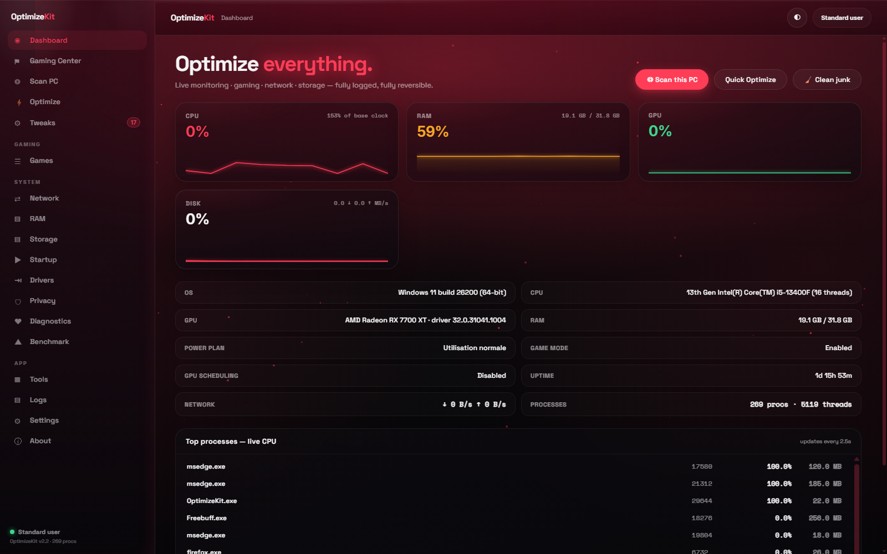
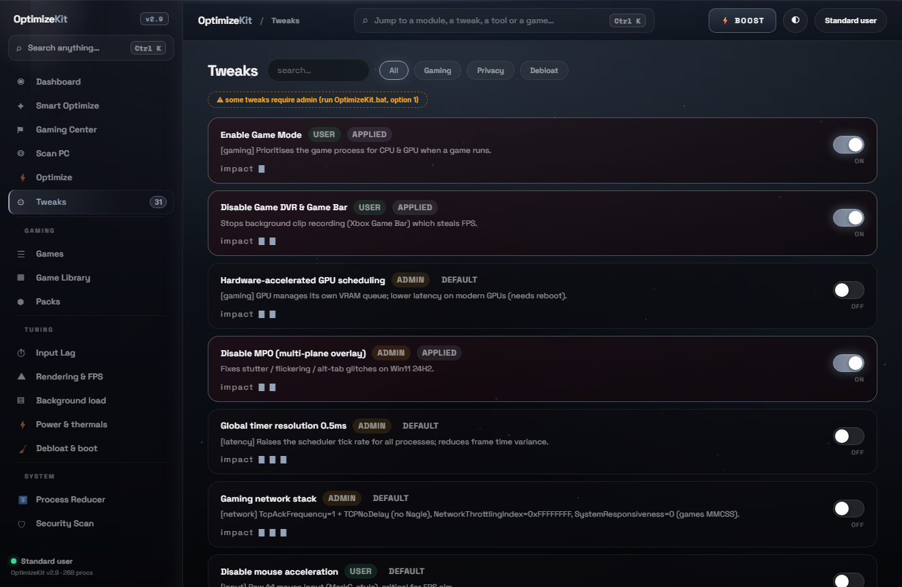
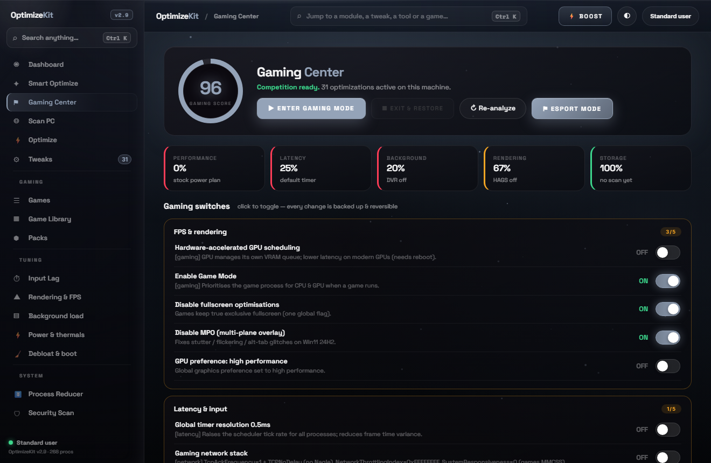
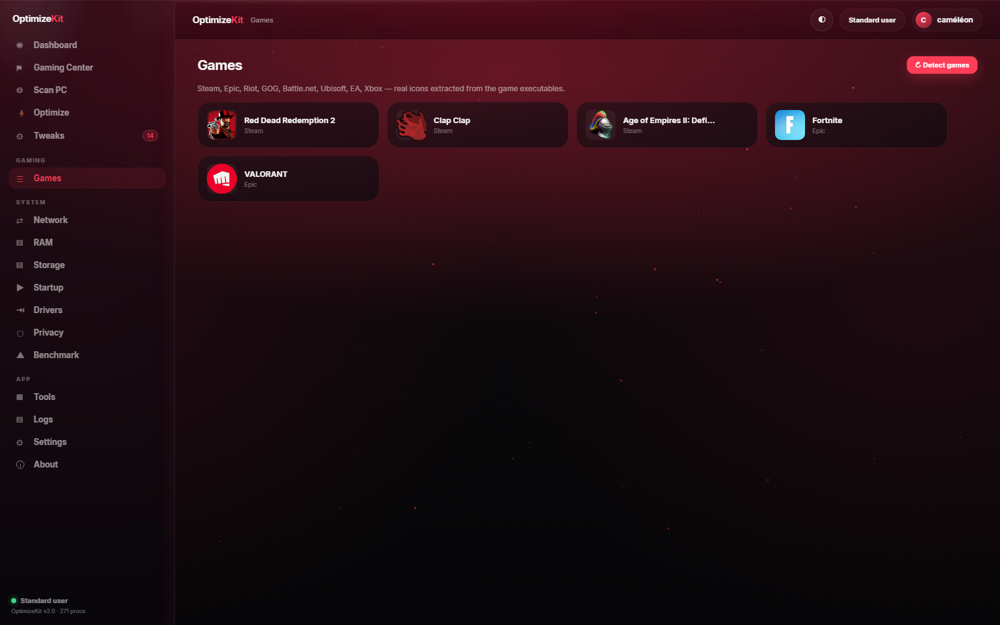
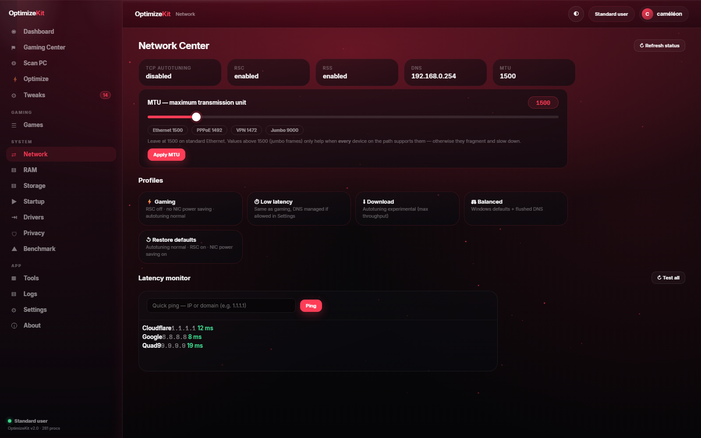
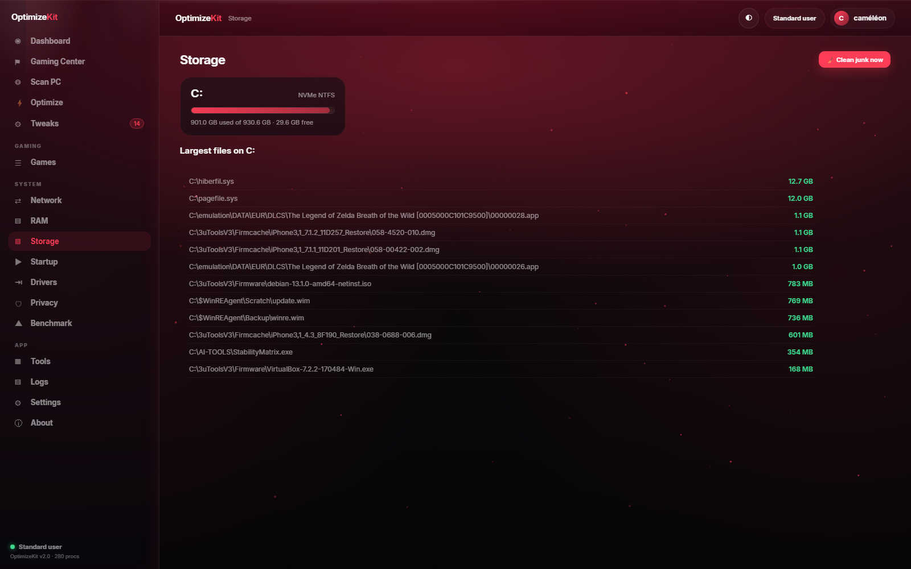
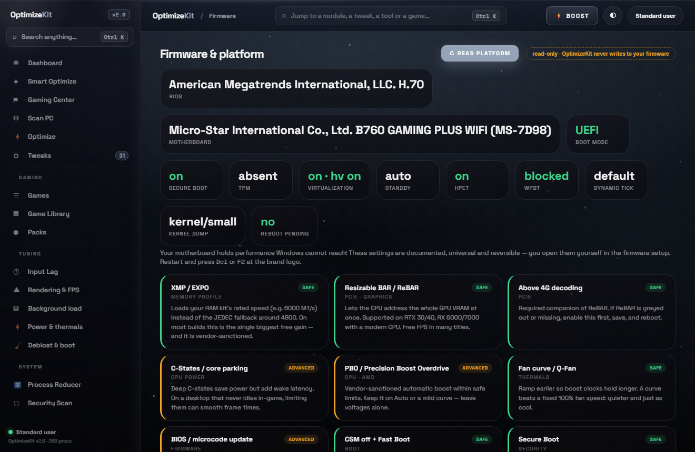
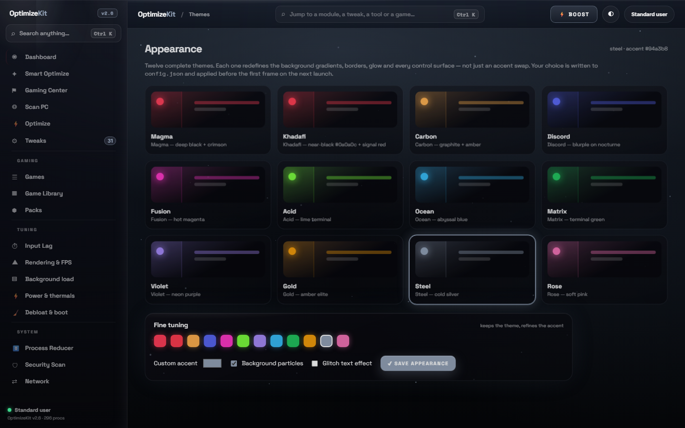
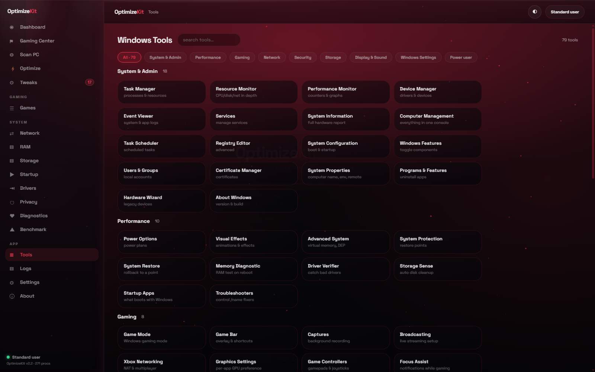

<div align="center">


# ⚡ OptimizeKit

**Windows Gaming Control Center — one compiled C++20 exe, one HTML/CSS/JS interface, every tweak reversible.**

[](../../releases)
[](https://github.com/cameleonnbss/OptimizeKit)
[](https://isocpp.org)
[](web/index.html)
[](LICENSE)
[](#-download)

**Desktop window dashboard** · **Gaming score** · **77 reversible tweaks** · **Firmware panel (SecureBoot/TPM/VT)** · **Driver auto-update engine** · **Process Reducer (EcoQoS)** · **Security scan** · **DiskScope** · **5 tuning centers** · **300-title game database + 106 covers** · **Network center** · **AnTuTu-style benchmark** · **79-tool catalog** · **Ctrl+K palette** · **12 themes** · **EN/FR**

`C++20 / Win32 / WebView2 / cpp-httplib` · `zero runtime dependencies` · `no install` · `no driver, no injection`

[⬇️ **Download v2.9.0**](../../releases/tag/v2.9.0) · [What's new](#-whats-new-in-290) · [Quick start](#-quick-start) · [Screenshots](#-screenshots) · [Safety](#%EF%B8%8F-safety-first) · **English** · [**Français**](README.fr.md)

</div>

---

## 🆕 What's new in 2.9.0

| | |
|---|---|
| **The v2.6 interface is back** | The liquid-glass web dashboard is once again **the** interface: double-click → the same HTML/CSS/JS UI opens in a **dedicated desktop window** (embedded WebView2 frame). If that window cannot be created, the dashboard opens in your **default browser — any browser** (Firefox, Chrome, Brave, Vivaldi…), never forced to Edge. `--browser` skips the window on purpose. |
| **Compiled binary + web UI, WormGPT-desktop style** | One static C++20 exe embeds its own HTTP server (loopback only) and the whole dashboard: HTML/CSS/JS interface, compiled language underneath. Exactly the architecture you asked for. |
| **Dashboard Highlights** | A live row of the newest modules — firmware identity, Secure Boot, driver age, games detected, Process Reducer, Security Scan, DiskScope, Benchmark — updates from real machine data and opens each view in one click. |
| **Featured pack categories** | The Packs page opens on ★ **In the spotlight** with the four flagship presets (Esport, Low latency, Fast clean boot, Privacy lock-down) plus per-category chips. |
| **Two CLI launchers, your way** | `OptimizeKit.bat` (no admin, never elevates) and `OptimizeKit-Admin.bat` (offers UAC once, full admin menu). Both run the numbered menus **without the exe** through the PowerShell engine — `/exe` opts into the compiled CLI. |
| **New dashboard quick actions** | ⚑ Esport mode and ⛭ Firmware join Scan / Quick Optimize / Clean junk on the hero card. |
| **Settings refresh** | Firmware & drivers and Updates cards now show the accent border; the firmware nudge setting loads properly. |
| **Fresh screenshots** | Every view re-captured from the live app (v2.9, real machine data). |

### Still from 2.8.0 / 2.7.0

| | |
|---|---|
| **Firmware & platform panel** | BIOS vendor/version, motherboard, boot mode, **Secure Boot**, **TPM**, VT-x/SVM + hypervisor, modern standby vs S3, HPET, WPBT, dynamic tick / TSC, kernel dump level, pending reboot — read-only |
| **Driver auto-update engine** | Real driver ages from the driver store, problem devices, **Windows Update driver scan trigger**, PnP rescan, vendor pages |
| **77 reversible tweaks** (28 aligned on WinUtil in 2.7, 24 more in the engine in 2.8) | Widgets, Location, Services-to-Manual + svchost tuning, Delivery Optimization, Consumer features, **WPBT block**, Razer block, Notifications, IPv4/IPv6/Teredo, disk cleanup + WinSxS trim, hibernation off, verbose BSoD, long paths, Game Mode (Win11), Edge & Brave debloat, UTC clock, restore point… |

### Still from 2.6.0 / 2.5.0 / 2.4.0

Process Reducer (eco mode / EcoQoS), Security scan (ports, persistence, ransomware patterns), DiskScope (dupes, space hogs), Steam/Epic cover art, game database (~300 titles, every store + every drive), batch icons, Game Library with genre-aware sets, 5 tuning centers, Ctrl+K palette, 12 full themes, ⚡ BOOST pill, first-run wizard with theme picker.

Full detail in [CHANGELOG.md](CHANGELOG.md).

## 📸 Screenshots

All shots captured from the live app (v2.9, real machine data, no mockups).

| Dashboard — with Highlights | Tweaks |
|---|---|
|  |  |

| Gaming Center | Games — real icons |
|---|---|
|  |  |

| Network Center | Storage |
|---|---|
|  |  |

| Firmware — live platform state | Themes — 12 packs |
|---|---|
|  |  |

| Tools — 79-launcher catalog | |
|---|---|
|  | |

## 📦 Download

| Release | Link |
|---|---|
| **v2.9.0 (current)** | https://github.com/cameleonnbss/OptimizeKit/releases/tag/v2.9.0 |
| v2.8.0 | https://github.com/cameleonnbss/OptimizeKit/releases/tag/v2.8.0 |
| v2.7.0 | https://github.com/cameleonnbss/OptimizeKit/releases/tag/v2.7.0 |
| v2.6.0 | https://github.com/cameleonnbss/OptimizeKit/releases/tag/v2.6.0 |
| All releases | https://github.com/cameleonnbss/OptimizeKit/releases |
| Changelog | [CHANGELOG.md](CHANGELOG.md) |

`OptimizeKit.exe` is fully **static** (MinGW-w64, ~6.6 MB): no runtime, no DLLs, no install. The whole interface ships inside the exe; an optional `web/` folder next to it just lets you serve the same dashboard from a fresh edit.

## ⚡ Quick start

| You want | Do this |
|---|---|
| **The app** (default) | Double-click `dist\OptimizeKit.exe` — the dashboard opens in its own desktop window |
| **The app, browser window** | `OptimizeKit.exe --web 8765` then open http://127.0.0.1:8765 (loopback only) |
| **CLI without admin** | Run `OptimizeKit.bat` — numbered menus, HKCU tweaks, reports |
| **CLI as admin** | Run `OptimizeKit-Admin.bat` — UAC prompt once, then every tweak, cleanup, restore-all |
| Direct engine flags | `OptimizeKit.bat -Status`, `-Apply id1,id2`, `-Profile gaming`, `-RestoreAll`, `-Silent` |
| Dashboard in your browser | `OptimizeKit.exe --browser` — opens your **default** browser, any browser |
| Native Direct2D window | `OptimizeKit.exe --native` |

The window **is the app**: the exact same liquid-glass interface as the browser — themes, Ctrl+K palette, game library, firmware panel, driver engine, benchmark, 77 tweaks — served by the embedded server and rendered in a dedicated desktop frame with a dark title bar and dynamic window title.

> 🛡️ **Safety**: every tweak has a one-click **restore to Windows default** (web UI + native UI + CLI + PowerShell `-RestoreAll`), and `.reg` backups live in `%LOCALAPPDATA%\OptimizeKit\`.

## 🎮 What's inside

- **Dashboard** — live machine state, gaming flags, quick profiles, **Highlights** (new), one-click benchmark
- **Tweaks** — all **77 tweaks** with instant apply/restore, filters, admin badges, impact stars
- **Gaming Center** — one-click profiles + ESPORT MODE + 12 quick switches + process priority/kill table
- **Packs** — preset bundles with ★ spotlight categories and per-category chips
- **Firmware (BIOS guide)** — live platform state + guided BIOS cards (read-only; the app never writes firmware)
- **Storage** — DiskScope: drives, safe cleanup targets, duplicate finder, largest files, folder sizes
- **Network** — TCP autotuning / RSS / MTU, profiles, latency monitor, DNS reset to DHCP
- **Security Scan** — antivirus, firewall, listening ports + owners, autostart persistence, one-click fixes
- **Process Reducer** — live CPU/RAM table, eco mode (EcoQoS), end, sweep, full restore
- **Games / Library** — every-store detection with real cover art, batch icons, genre-aware boost
- **Tools** — 79 Windows tool launchers; **Themes** — 12 full packs + custom accent; **Ctrl+K** palette; EN/FR switch

Without the exe, both `.bat` launchers expose the same feature set through the PowerShell engine: 71 tweaks with status, gaming/privacy/debloat/full profiles, network center, junk cleanup, firmware report, driver info, restore-all — in the admin and non-admin menus.

## 🖥️ CLI

Two launchers, one engine — no exe required:

```
OptimizeKit.bat                    CLI menu, NO admin (never elevates)
OptimizeKit-Admin.bat              CLI menu, offers UAC once (full admin menu)
OptimizeKit.bat /exe               same menus through the compiled C++ CLI (if built)

OptimizeKit.bat -Status            tweak states, read-only
OptimizeKit.bat -Apply id1,id2     apply specific tweaks
OptimizeKit.bat -Profile gaming|privacy|debloat|full
OptimizeKit.bat -Silent            gaming profile, no prompts
OptimizeKit.bat -RestoreAll        back to Windows defaults
OptimizeKit.bat -Firmware          BIOS / SecureBoot / TPM (read-only)
OptimizeKit.bat -Drivers           GPU/driver info + vendor pages
OptimizeKit.bat -Network           latency + DNS benchmark
OptimizeKit.bat -Cleanup           junk cleanup
```

The exe itself:

```
OptimizeKit.exe                    dedicated desktop window: embedded dashboard (default)
OptimizeKit.exe --browser          dashboard in the default browser (any browser)
OptimizeKit.exe --native           native Direct2D dashboard window
OptimizeKit.exe --web [port]       serve the web dashboard, no window (loopback)
OptimizeKit.exe --cli              numbered CLI menu (user or admin)
OptimizeKit.exe --profile gaming|privacy|full|clean
OptimizeKit.exe --apply <tweak-id>       OptimizeKit.exe --restore <tweak-id>
OptimizeKit.exe --list             list all tweak ids
OptimizeKit.exe --clean            junk cleanup
OptimizeKit.exe --info             system summary
OptimizeKit.exe --firmware         BIOS / SecureBoot / TPM / kernel options report
OptimizeKit.exe --drvupdate        driver age report + Windows Update scan
OptimizeKit.exe --ping <host>      latency test
```

## 🏗️ Under the hood

```
┌────────────────────────────────────────────────────────┐
│  OptimizeKit.exe (static C++20, ~6.6 MB)               │
│                                                        │
│  ┌──────────────┐  ┌────────────────────────────────┐  │
│  │ Win32 window │  │  embedded HTTP server          │  │
│  │ (WebView2    │──│  (cpp-httplib, 127.0.0.1 only) │  │
│  │  frame)      │  │  serves the embedded UI + JSON │  │
│  └──────────────┘  └───────────────┬────────────────┘  │
│                                    │                   │
│  ┌────────────────────────────────┬┴─────────────────┐ │
│  │  HTML / CSS / JS dashboard     │  C++ core         │ │
│  │  (embedded in the exe)         │  tweaks · monitor │ │
│  │  12 themes · Ctrl+K · EN/FR    │  firmware · games │ │
│  └────────────────────────────────┴───────────────────┘ │
└────────────────────────────────────────────────────────┘
```

- **Compiled language**: every action goes through C++ modules (tweaks, monitor, firmware, games, reducer, security, diskscope, drivers) — no Python, no Node, no runtime.
- **Web interface**: the dashboard is plain HTML/CSS/JS, embedded in the exe and also editable in `web/` for development.
- **Firmware inventory** reads the SMBIOS identity (WMI), the UEFI Secure Boot state machine, the TPM (Win32_Tpm with a PnP fallback for non-elevated sessions), virtualization state including the running hypervisor, modern-standby vs S3 policy, and the boot options `bcdedit` manages. Strictly **read-only**.
- **Kernel-visible tweaks**: WPBT execution block, HPET policy, dynamic tick, MSI mode for GPU/NIC, interrupt affinity, `Win32PrioritySeparation`, MMCSS gaming task, svchost split threshold — documented registry/service paths only, all reversible.
- **Driver updates**: real driver ages from `Control\Class` records, problem devices, then **Windows Update's own driver scan** (`UsoClient`, the supported orchestrator) or the vendor page. Nothing downloads behind your back.

## 🛡️ Safety first

- **Every tweak is reversible** — switch OFF restores the exact Windows default value.
- **Registry backups** before any change: `%LOCALAPPDATA%\OptimizeKit\backup_*.reg`.
- **Honest descriptions** — no magic FPS promises; the RAM trim page even explains why "empty standby" is not "extra RAM"; the firmware panel says "unknown" instead of inventing values.
- **Gaming Mode** snapshots your power plan and restores everything on exit.
- **Nothing runs at boot**, no service is installed; the exe only acts when you ask. The server listens on 127.0.0.1 only — never on the network.
- Source curated from [Chris Titus Tech's WinUtil](https://github.com/ChrisTitusTech/winutil) (MIT), Microsoft documentation and the PC-gaming community — every tweak shows its origin.

## 🏗️ Build from source

```
git clone https://github.com/cameleonnbss/OptimizeKit
cd OptimizeKit
build.bat          rem MinGW-w64 g++ 13+ (winlibs / MSYS2)
```

Output: `dist\OptimizeKit.exe` (+ optional `dist\web\`). Or use the provided CMakeLists with any MinGW toolchain. Regenerate the icon set with `python tools/make_icon.py` (Pillow); `tools/embed_web.py` re-embeds edited dashboard files.

## 📄 License

MIT — see [LICENSE](LICENSE). Tweaks curated from WinUtil (MIT), Microsoft docs and community knowledge.

<div align="center">
<b>If OptimizeKit saved you time, a ⭐ on the repo helps a lot.</b>
</div>
