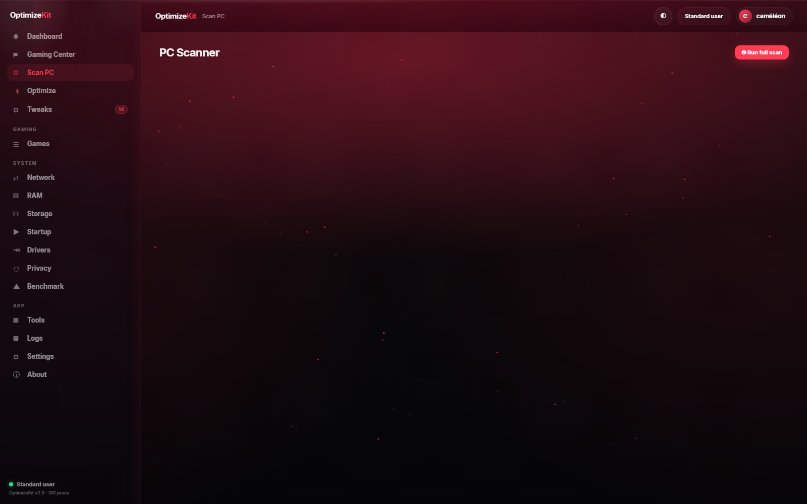
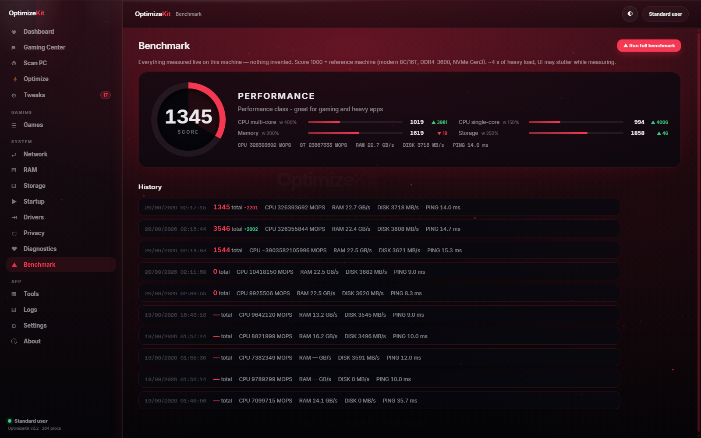
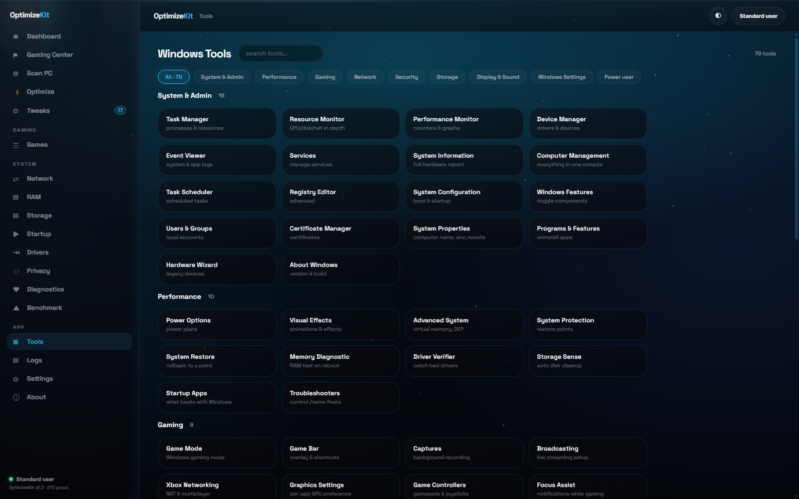

<div align="center">


# ⚡ OptimizeKit

**Windows Gaming Control Center — one exe, liquid-glass dashboard, every tweak reversible.**

[](../../releases)
[](https://github.com/cameleonnbss/OptimizeKit)
[](https://isocpp.org)
[](LICENSE)
[](#-download)

**Live monitoring** · **Gaming score** · **Smart Optimize** · **49 reversible tweaks** · **5 tuning centers** · **300-title game database + 106 covers** · **Network center** · **AnTuTu-style benchmark** · **79-tool catalog** · **Ctrl+K command palette** · **12 full themes** · **EN/FR** · **Full activity log**

`C++20 / Win32` · `embedded HTTP server` · `zero dependencies` · `no install` · `no driver, no injection`

[⬇️ **Download v2.6.0**](../../releases/tag/v2.6.0) · [What's new](#-whats-new-in-260) · [Quick start](#-quick-start) · [Screenshots](#-screenshots) · [Safety](#%EF%B8%8F-safety-first) · [Français](README.fr.md)

</div>

---

## 🆕 What's new in 2.6.0

| | |
|---|---|
| **Process Reducer** | Live CPU/RAM table of everything running — set any process to eco (lower priority + power throttling), end it, sweep all background noise, restore everything |
| **Security scan** | Real evidence only: antivirus + signature age, firewall per profile, every listening port and its owner, outbound connections with remote IPs, autostart persistence, ransomware-pattern files — each finding has a one-click fix |
| **DiskScope tools** | Duplicate finder, space-hog cleanup targets and folder sizes, built with assets from the [DiskScope-CLI](https://github.com/cameleonnbss/DiskScope-CLI) project |
| **Real cover art** | The Game Library pulls box art for the top-played Steam and Epic titles from the store CDNs — most tiles show the actual jacket |
| **Dashboard polish** | The accent-color flyout in the top-left is fully functional; view transitions and hover states animated throughout |

### Still from 2.5.0

| | |
|---|---|
| **Game database** | ~300 known PC titles with their exe stems, aliases and genres — a game installed outside any store is still recognised, named and given a suggested set |
| **Detect everything** | Six new scans (Battle.net, Ubisoft, EA, itch.io, per-user keys, Xbox paths) **plus a survey of every fixed drive**; Steam on `D:` is found through the registry |
| **Icons for all** | One batch pass extracts the icon of *every* detected game from its own exe — not the first twelve |
| **More buttons** | Launch, boost, gaming mode, extract icon, open folder, copy path, library preset, boost all, extract all, random, per-store shortcuts |
| **Library ×2** | Cover art + database merged, genre/installed/cover filters, five sort orders, INSTALLED badges with the real icon |

### Still from 2.4.0

| | |
|---|---|
| **Game Library** | 106 covers grouped by genre — pick a title, see the exact set it will apply, apply or restore it in one click |
| **5 tuning centers** | Input Lag · Rendering & FPS · Background load · Power & thermals · Debloat & boot — catalog state plus cards measured on your machine, marked `· LIVE` |
| **Ctrl+K palette** | Jump to any module, tweak, tool, pack or game; tweaks toggle straight from the palette and show their current state |
| **12 themes** | Full-surface themes with per-theme accent memory, previewed in a gallery — Magma, Khadafi, Carbon, Discord, Fusion, Acid, Ocean, Matrix, Violet, Gold, Steel, Rose |
| **⚡ BOOST** | One pill in the top bar: the competitive set, reversible in one click |
| **Faster boot** | Catalog and network reads run in parallel (~2× faster splash) |

Full detail in [CHANGELOG.md](CHANGELOG.md).

## 📸 Screenshots

| Gaming Center | Dashboard |
|---|---|
|  |  |

| Tweaks — instant ON/OFF switches | Games — real icons |
|---|---|
|  |  |

| Network Center | PC Scanner |
|---|---|
|  |  |

| Benchmark — AnTuTu-style score | Theme packs (Ocean) |
|---|---|
|  |  |

| Tools — 79-launcher catalog | Storage |
|---|---|
|  |  |

| Splash screen | |
|---|---|
|  | |

## 📦 Download

| Release | Link |
|---|---|
| **v2.6.0 (current)** | https://github.com/cameleonnbss/OptimizeKit/releases/tag/v2.6.0 |
| v2.4.0 | https://github.com/cameleonnbss/OptimizeKit/releases/tag/v2.4.0 |
| All releases | https://github.com/cameleonnbss/OptimizeKit/releases |
| Changelog | [CHANGELOG.md](CHANGELOG.md) |

`OptimizeKit.exe` is fully **static** (MinGW-w64, ~6 MB): no runtime, no DLLs, no install. It embeds an HTTP server and the liquid-glass web dashboard (`web/` folder ships next to it).

## ⚡ Quick start

| You want | Double-click |
|---|---|
| **The menu** (everything, exe optional) | `OptimizeKit.bat` |
| **The dashboard** (web UI in a standalone window) | `OptimizeKit.bat` option 5, or `dist\OptimizeKit.exe` |
| Direct PowerShell engine (no exe) | `powershell -File PowerShell\OptimizeKit.ps1` or `OptimizeKit.bat -Status` |
| Headless web dashboard | `OptimizeKit.exe --web 8765` |

The dashboard opens on a **splash boot sequence** (detecting hardware → reading Windows state → loading tweak catalog → measuring network), then lands on the **Gaming Center** with your machine's gaming score.

> 🛡️ **Safety**: every tweak has a one-click **restore to Windows default** (web UI + CLI), the PowerShell engine has `-Restore`, and `.reg` backups live in `%LOCALAPPDATA%\OptimizeKit\`.

## 🎮 Gaming Center

The new home page scores your machine 0–100 from the real state of gaming-relevant settings, then groups every gaming switch by category:

- **FPS & rendering** — HAGS, Game Mode, fullscreen optimizations, MPO, GPU preference
- **Latency & input** — 0.5 ms timer, gaming network stack (TcpAckFrequency/NoDelay/MMCSS), mouse acceleration, menu delay, Win32PrioritySeparation
- **Background load** — Game DVR, background apps, SysMain, search indexing, Xbox Live services
- **Power & thermals** — Ultimate Performance plan, HPET

Every switch is a real toggle: click → registry snapshot → apply → animated confirmation. Click again to restore the Windows default. Category chips show `OPTIMIZED / 3/5 / STOCK` at a glance.

## 🔧 The dashboard (WormGPT-style liquid glass)

Deep black + your accent color (accent picker in the top bar), **12 full theme packs** in Settings — Magma, Khadafi (signal red on near-black), Carbon, Discord, Fusion, Acid, Ocean, Matrix, Violet, Gold, Steel, Rose — squared letterspaced Khadafi-style CTAs, a top-bar **⚡ BOOST** pill that applies the competitive set in one click, glassmorphism with moving specular sheen, mouse-following particles, Inter & Space Mono. Served by an embedded C++ HTTP server on `127.0.0.1:8765`, opened as a chromeless app window.

| View | What you get |
|---|---|
| **Dashboard** | Live CPU / RAM / GPU / disk with 60-second sparklines, network throughput, process/thread counts, top processes (2.5 s refresh) |
| **Gaming Center** | Gaming score ring, category score cards, grouped ON/OFF switches, Gaming Mode enter/exit |
| **Tweaks** | All 49 tweaks as switch cards: instant apply / instant restore, search, category filters, ADMIN/USER badges, impact bars, live count in the sidebar |
| **Smart Optimize** | Ranks the whole catalog against a goal (Gaming / Latency / Privacy / Balanced) from the machine's **real** state, with a weight and a "why" per item, per-item checkboxes and one apply |
| **Games** | Nine stores + a survey of every fixed drive, a built-in database to name and classify what it finds, real icons extracted from the executables, one-click launch / reveal, per-game boost (IFEO persistent priority), boost-all, Gaming Mode and store shortcuts |
| **Game Library** | Cover art merged with the built-in database — pick a title and apply the set that fits its genre, with the exact tweak list shown first; installed titles are badged with their real icon (see below) |
| **Packs** | Six ready-made bundles (Esport, Low latency, Play & stream, Laptop/thermals, Fast clean boot, Privacy) with a live progress bar, Apply/Restore in one click and "What's inside" resolving the real tweak names |
| **Input Lag** | 14 settings on the hand-to-pixel path (timer, foreground quantum, MSI mode, interrupt affinity, USB/PCIe power states, network stack) + an explicit **Measure** button for the DPC/ISR and jitter sample |
| **Rendering & FPS** | Hardware GPU scheduling, MPO, fullscreen flips, windowed-game optimizations, VRR, Auto-HDR, per-app GPU preference, Game Bar/DVR — with the live HAGS state and driver version as measured cards |
| **Background load** | Store apps, SysMain, indexing, Xbox services, telemetry tasks, compositor effects, OneDrive, bloat apps — 15 switches with the live process count |
| **Power & thermals** | Ultimate Performance plan, HPET, PCIe ASPM, USB suspend, fast startup — with the active plan as a measured card |
| **Debloat & boot** | Store bloat, OneDrive, telemetry tasks, Storage Sense, boot logo, indexing — measured against the real junk size on disk |
| **Scan PC** | Full system scan: junk files, tweak state, network config, power plan, startup load, drivers, games — every finding has an Apply button |
| **Optimize** | One-click profiles (SAFE / GAMING / PRIVACY / RESTORE ALL) with snapshot → apply → verify |
| **Network** | Adapter status (autotuning, RSC, RSS, DNS, MTU), profiles, **MTU slider** with presets (Ethernet/PPPoE/VPN/Jumbo), latency monitor, quick ping |
| **RAM** | Usage graph, committed/cached stats, top consumers, honest standby-list trim (with an explanation of what it really does) |
| **Storage** | Drives with NVMe/SATA bus detection, usage bars, largest files |
| **Startup** | HKCU/HKLM Run keys + startup folders, one-click disable (reversible via stash) |
| **Drivers** | GPU name + driver version, vendor download / DXDiag / Device Manager shortcuts, clean-install advice |
| **BIOS guide** | 12 firmware cards (XMP/EXPO, ReBAR, Above 4G, C-States, PBO, fan curve, flashing, CSM, Secure Boot, virtualization…) marked SAFE / ADVANCED — **read-only**: OptimizeKit never writes to firmware |
| **Privacy** | Telemetry, advertising ID, activity history, Bing search, Copilot, Edge background — one profile plus per-item switches |
| **Diagnostics** | Real measurements only: effective CPU clock (PDH), DPC/ISR kernel load, unbuffered disk latency, 20-packet network quality (avg/min/max/jitter/loss). CPU temperature is deliberately **not** shown — Windows does not expose it without a vendor driver |
| **Benchmark** | AnTuTu-style **score out of ~4000** (1000 = mainstream reference): CPU multi/single-core, memory bandwidth, NVMe/HDD read, latency — weighted sub-scores with bars, per-run deltas, 20-run history. The first-run wizard offers to benchmark so you can compare before/after optimizing |
| **Tools catalog** | **79 Windows tools** in 9 searchable categories (System, Performance, Gaming, Network, Security, Storage, Display, Settings, Power user) — every console, control panel applet and ms-settings page, one click |
| **Themes** | 12 full-surface themes previewed as a gallery, per-theme accent memory, custom accent, particles & glitch toggles |
| **Logs** | Color-coded activity log with live filter |
| **Settings** | Language, kill list for Gaming Mode, DNS management, backup behaviour — persisted in `config.json` |

Press **Ctrl+K** anywhere for the command palette (modules, tweaks, tools, packs, games) and **Enter** to act on the highlighted row.

## 🎮 Game Library

Two sources, one grid: **106 titles with real cover art** (imported box art) and a **built-in database of ~300 known PC games** (`src/core/gamedb.h`) that supplies the name, the genre and the suggested set for everything else. Titles the database knows but that have no art get a generated tile instead of breaking the grid.

Pick a cover and OptimizeKit resolves the set that fits that genre, shows **exactly** which tweaks it contains, then applies/restores them through the normal snapshot path. Games detected on this machine are badged `INSTALLED` with their real extracted icon, and can be launched or revealed in Explorer straight from the library. Filters: genre, installed, cover art. Sorts: A→Z, Z→A, genre, installed first, cover art. There is also a **Surprise me** button. Nothing hidden, nothing irreversible.

The covers are imported from the Khadafi optimizer's `assets/gamelogos` folder — thumbnails only, and deliberately **not** embedded in the exe (they are third-party box art):

```
python tools/import_gamelogos.py [source_folder]   # default: %USERPROFILE%\Downloads\Khadafi_extract\assets\gamelogos
```

It downscales every cover to 400 px wide, writes `web/assets/gamelogos/manifest.json` (real title + family per key) and reports any title with no cover. Without the covers the module degrades to an explanatory message instead of failing.

## 🕹️ Game detection

Multi-provider scanner — no single-store lock-in:

| Provider | Source |
|---|---|
| **Steam** | registry `SteamPath`/`InstallPath` → `libraryfolders.vdf` → `appmanifest_*.acf` (all libraries, all drives) |
| **Epic** | `%PROGRAMDATA%\Epic\EpicGamesLauncher\Data\Manifests\*.item` |
| **Riot** | `HKLM\SOFTWARE\Riot Games, Inc.\*` (VALORANT, LoL…) |
| **GOG** | `HKLM\SOFTWARE\WOW6432Node\GOG.com\Games\*` |
| **Battle.net** | `HKLM\SOFTWARE[(WOW6432Node)\]Blizzard Entertainment\*` → `InstallLocation` (WoW, Overwatch, Diablo…) |
| **Ubisoft** | `…\Ubisoft\Launcher\Installs\*` → `InstallDir` |
| **EA** | `…\Electronic Arts\EA Games\*` → `Install Dir` |
| **itch.io** | `%APPDATA%\itch\apps\*` |
| **Registry** | Uninstall keys (machine **and** user) under Epic/Riot/GOG/Battle.net/Blizzard/Ubisoft/EA/Xbox/Rockstar/Amazon/itch/Wargaming dirs |
| **Every drive** | `\Games`, `\Game`, `\Jeux`, `\GOG Games`, `\Epic Games`, `\Riot Games`, `\Rockstar Games`, `\XboxGames`, `\Battle.net`, `\Program Files (x86)`, `\SteamLibrary\steamapps\common` … — only folders the built-in database recognises are opened |

Every candidate exe is matched against the **built-in game database** (`src/core/gamedb.h`, ~300 titles with exe stems + aliases + genre), so a game gets its real name and family even with no launcher manifest. Then: per-game profiles (persistent high priority via IFEO), gaming mode per game, `POST /api/games/launch`, `POST /api/games/boost-all`, and real icon extraction (`SHDefExtractIconW` → PNG cache, in batch via `POST /api/games/icons`).

## 🖥️ CLI

`OptimizeKit-cli.bat` gives numbered menus (user or admin). Direct flags:

```
OptimizeKit.exe --native            native Direct2D dashboard
OptimizeKit.exe --web [port]        web dashboard without opening a browser
OptimizeKit.exe --profile gaming|privacy|full|clean
OptimizeKit.exe --apply <tweak-id>
OptimizeKit.exe --restore <tweak-id>
OptimizeKit.exe --list              list tweak ids
OptimizeKit.exe --clean             junk cleanup
OptimizeKit.exe --info              system summary
```

## 🛡️ Safety first

- **Every tweak is reversible** — switch OFF restores the exact Windows default value.
- **Registry backups** before any change: `%LOCALAPPDATA%\OptimizeKit\backup_*.reg`.
- **Honest descriptions** — no magic FPS promises; the RAM trim page even explains why "empty standby" is not "extra RAM".
- **Gaming Mode** snapshots your power plan and restores everything on exit.
- **Nothing runs at boot**, no service is installed; the exe only acts when you ask.
- Source curated from [Chris Titus Tech's WinUtil](https://github.com/ChrisTitusTech/winutil) (MIT), Microsoft documentation and the PC-gaming community — every tweak shows its origin in the CLI.

## 🏗️ Build from source

```
git clone https://github.com/cameleonnbss/OptimizeKit
cd OptimizeKit
build.bat          rem MinGW-w64 g++ 13+ (winlibs / MSYS2)
```

Output: `dist\OptimizeKit.exe` + `dist\web\`. Or use the provided CMakeLists with any MinGW toolchain.

## 📄 License

MIT — see [LICENSE](LICENSE). Tweaks curated from WinUtil (MIT), Microsoft docs and community knowledge.

<div align="center">
<b>If OptimizeKit saved you time, a ⭐ on the repo helps a lot.</b>
</div>
